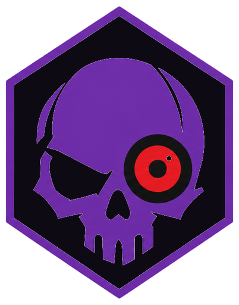
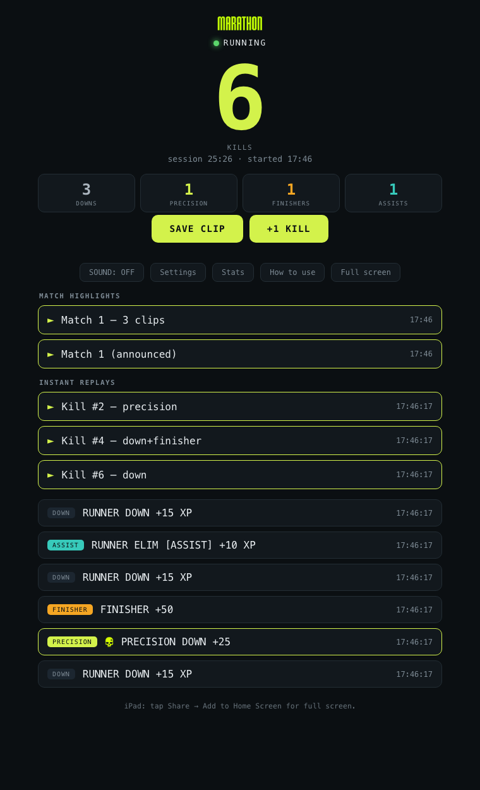
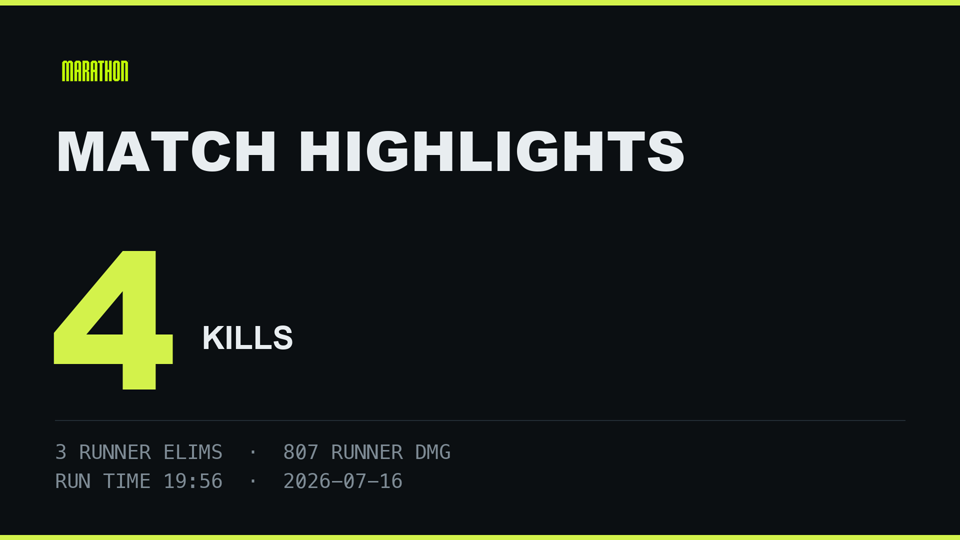
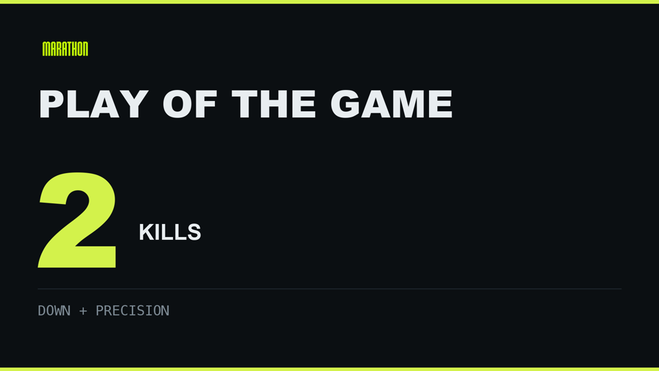
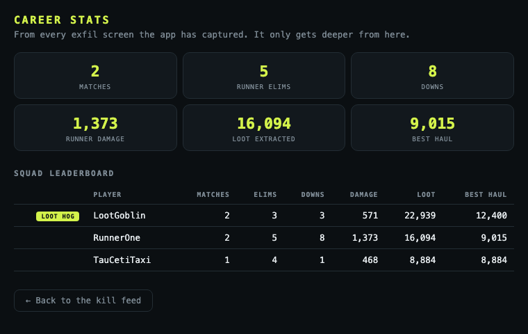
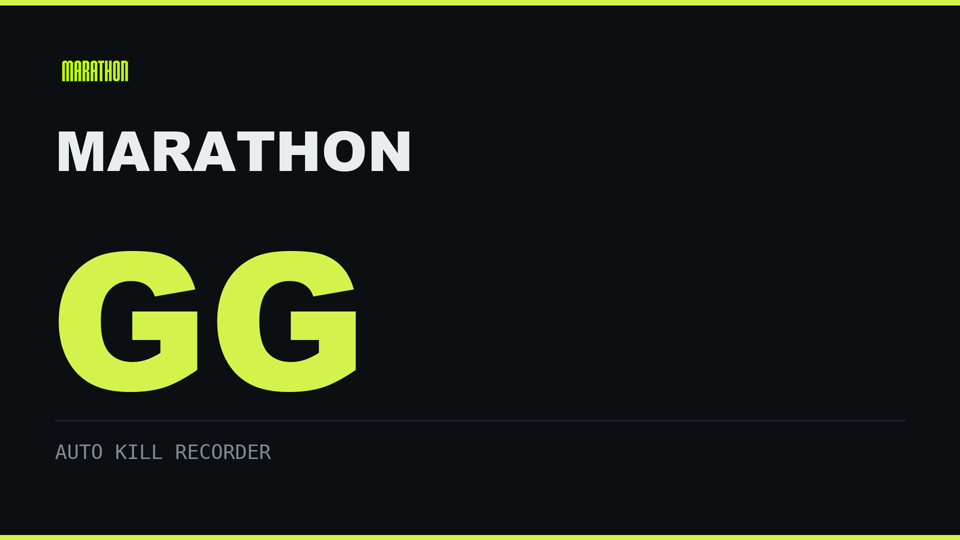

# WITNESS



**It sees everything.** WITNESS automatically clips every kill you get —
born in Bungie's **Marathon**, teachable to any game with a kill popup —
and turns each match into a highlight reel.

**New here? Follow [QUICKSTART.md](QUICKSTART.md)** — zero to auto-clipped
kills in ~15 minutes, no coding.


**Security & privacy:** WITNESS reads your screen and controls OBS, so it documents itself rather than asking for trust. [SECURITY.md](SECURITY.md) lists every network destination in the codebase (four, all optional — no telemetry), confirms there is no dynamic code execution and no secret in any commit, and discloses two design choices you should make knowingly: the dashboard has no password, and auto-update runs code from this repo.

## Any game (beta): teach it your game

Marathon is the home game, but the engine works for **any game with an
on-screen kill confirmation**. Run the wizard (or the **Teach a game**
button in the app):

    .venv\Scripts\python main.py --teach

Name the game, alt-tab in, get a kill inside 90 seconds — the wizard reads
everything on screen, ranks the popup-like lines, asks which one was your
kill, and measures the trigger phrase, screen region and reward marker.
Then it **verifies**: get one more kill and it watches the region it just
measured with the real detector and tells you whether it fired. If it
didn't, it shows what it actually read there, so you know whether the
region or the phrase was wrong — you find out in 45 seconds instead of
after a wasted session. Bot matches / practice ranges are perfect for this.

**Get two or three kills during the watch, not one.** Many games print the
victim's name in the popup ("KNOCKED DOWN xXTTVGamerXx"); seeing it fire on
different players is how the wizard knows which words repeat and which are
just somebody's name. With a single kill it can't tell, and it will say so.

Profiles are pure data. Share yours: PR your `games/<game>.yaml` and
everyone gets that game.

**What a taught game gets today:** kill detection, auto-clips, the counter,
the live dashboard, killstreaks, per-match and session reels, Shorts, and
its own colors. **What it doesn't:** the systems that read Marathon's
specific screens — exfil stats, W/L outcomes, the Menace Report, runner
detection — stay off until that game's screens are mapped. The teach wizard
learns kill popups; it does not yet learn scoreboards.

## What it looks like

**The live dashboard** (any phone/iPad on your Wi-Fi) — kill counter,
breakdown, instant replays you can tap seconds after the kill, per-match
highlight reels, a +1 button for anything the detector misses:



**Highlight reels** open on a stat card, lead with your Play of the Game, and
close with a GG — music bed, crossfades, kill chyrons, and an optional
announcer voiceover:




**Career + squad stats**, parsed straight off the exfil screens — including
your teammates. The squad's top extractor wears the crown. The **Menace
Report** reads gamertags off the kill feed: who you've downed (with a
"last downed" timestamp for repeat offenders) and who's been downing you —
set `gamertag` in config.yaml to your exact in-game name:





**Every session, kept.** The Archive lists every past session with per-match
recaps and one-tap access to all its reels and clips — "save" downloads any of
them to share:


Marathon has no public kill API, so this tool *watches your screen*: it OCRs
the center-screen reward popup that appears only on your downs
(**"RUNNER DOWN +15 XP"**, **"FINISHER +50"**, **"PRECISION DOWN +25"**). On
each kill it saves OBS's **Replay Buffer** as a clip, bumps a counter, and
feeds a live dashboard you open on an iPad/phone.

```
screen -> OCR -> detector -> OBS replay save -> clips, reels, shorts, dashboard
```

## What you get

- **Auto clips** — every kill saved by OBS; back-to-back down+finisher get
  grouped into one clip (`kill_coalesce_seconds`).
- **Live iPad dashboard** — kill counter, feed, kill ding, manual SAVE CLIP
  button, instant replays (tap any kill to rewatch it seconds later), and a
  settings panel. Open `http://<PC-IP>:8000` on the same Wi-Fi.
- **Match highlight reels** — when the EXFILTRATED screen appears, the match's
  clips become an ESPN-style reel: stat title card, **Play of the Game**
  (your biggest clip leads), optional music bed, and an optional second
  version with an announcer voiceover. It pops up on the iPad automatically.
- **Exfil stat capture** — the summary screen is OCR'd and logged to
  `stats/match_stats.csv`, with an audit line comparing the game's kill count
  to what was detected. The screen itself is saved as a PNG.
- **Vertical Shorts** — each clip also renders as a 1080x1920 short (blurred
  background, centered gameplay, "KILL #3 - FINISHER" label), upload-ready.
- **Session recap** — montage, shareable match-card PNG, Play of the Night
  (the single best clip of the session, cut into its own reel), and an HTML
  recap at session end. Closed the app mid-build? It finishes at next launch.
- **Tight cuts** — reels start seconds before each kill, not 30 seconds of
  buffer lead-in. Kill timing is recorded with every clip.
- **Scoreboard-accurate counting** — the exfil screen's own numbers reconcile
  the kill count every match; a missed detection self-corrects. Double kills
  count as two (stacked popups are counted, not just seen).
- **Killstreaks** — FIRST BLOOD, HEATING UP, ON FIRE, RAMPAGE, MENACE, APEX,
  plus SHARPSHOOTER for precision chains: on-screen toasts, voiced call-outs,
  and a live streak chip on the dashboard. Streaks persist until you die.
- **The WITNESS Report** — an end-of-night dossier in the app's ominous
  narrator voice: confirmed kills, prime target, standing threat, verdict.
  Shown in the Archive and spoken over the session reel's intro.
- **W/L record** — EXFILTRATED vs ELIMINATED is read off the summary screen:
  survival rate, deaths, and your best exfil streak on the Stats page.
- **Menace Report** — who you've downed and who keeps downing you, gamertags
  read straight off the kill feed, with MENACED / NEMESIS callouts.
- **Detection health** — a live fps/VRAM readout and a one-click Benchmark
  that measures OCR speed on your machine and tells you the headroom.

## Console players?

Yes — with a capture card and any spare PC. The whole pipeline just reads a
video feed, so: console -> HDMI capture card (passthrough to your TV, zero
added latency) -> a PC running OBS + this app. Every feature works exactly the
same — detection, clips, reels, stats, the phone dashboard. The PC doesn't
need to be a gaming rig (the console renders the game); anything that passes
`--bench` works. A ~$20 USB HDMI grabber is enough — the popup text is large.
In OBS, right-click the capture-card source -> Fullscreen Projector on the
monitor this app watches.

Without a PC anywhere in the chain there's nothing we can do — no code can
run on the console itself.

## Anti-cheat note

This tool never touches the game: it does **not** read game memory, inject
code, hook APIs, or send any input. It only reads the *picture* on screen and
controls OBS — the same category as OBS, ShadowPlay, or Medal.tv. For even
lower theoretical exposure, set `capture_source: obs_virtualcam` so this tool
only reads OBS's Virtual Camera; for provably zero risk, run it on a second PC
fed by a capture card. No guarantees about Bungie's policies — use at your own
discretion.

## Security notes

Worth knowing before you run someone else's recorder:

- **Nothing leaves your machine** except: the update check to this GitHub repo
  (HTTPS), and — only if you set it up yourself — YouTube uploads using your
  own Google OAuth credentials. No telemetry, no accounts, no third parties.
- **Auto-update runs code from this repo.** That's what an auto-updater is:
  whatever lands on the `main` branch runs on your PC at next launch. If you
  don't want that trust relationship, set `auto_update: false` and update
  manually by reading the diffs.
- **The dashboard has no password.** It serves on your local network so a
  phone/iPad can reach it; anyone on the same Wi-Fi can view stats and press
  its buttons (save clip, +1, settings). Fine at home — on shared or public
  Wi-Fi, set `web_lan: false` (this PC only) or `web_dashboard: false`.
- **Credentials stay local and out of git**: your OBS password lives in your
  local `config.yaml` (never overwritten by updates), and
  `client_secret.json` / `youtube_token.json` are gitignored.
- The dashboard serves only fixed assets and clips the app itself registered —
  requests can't reach arbitrary files, and on-screen text is HTML-escaped.

## Requirements

- Windows PC (the game machine). NVIDIA GPU recommended for EasyOCR.
- **OBS 28+** (ships with obs-websocket v5).
- **Python 3.9+**.
- **[ffmpeg](https://www.gyan.dev/ffmpeg/builds/ffmpeg-release-essentials.zip)**
  for reels/shorts/montage: drop `ffmpeg.exe` (and `ffprobe.exe`) in the app
  folder or have it on PATH.

## Performance — will my PC handle it?

Don't guess — **measure it on your machine**:

```bat
python main.py --bench        (or double-click "4 - Benchmark....bat")
```

It times the real capture+OCR loop and gives a verdict (run it with the game
open for the honest number). What the app actually costs while you play:

- **Per frame**: one small screen-region grab + one OCR pass, 5x/second.
  On a GPU that's ~10–40 ms of light inference — a fraction of one frame's
  budget, nowhere near the game's own load.
- **VRAM**: EasyOCR holds ~1–1.5 GB. Any 6 GB+ NVIDIA card (GTX 1060 / RTX
  2060 and up) runs it comfortably alongside the game — an RTX 2070 is well
  clear. CUDA builds cover GTX 10-series through RTX 50-series.
- **No GPU / AMD**: it still works on CPU — expect it to catch slightly fewer
  split-second popups. Set `poll_fps: 3` and `ocr_upscale: 2` to lighten it.
- **Video work happens after you stop playing**: reels, Shorts, and montage
  encode at session end (and reels ~30s after each exfil), not mid-fight.
  Clip recording itself is OBS's replay buffer — the thing you already run.

## 1. One-time OBS setup

1. **WebSocket:** *Tools → WebSocket Server Settings* → enable; note the port
   (4455) and password.
2. **Replay Buffer:** *Settings → Output → Replay Buffer* → enable, ~30s max.
   Set a recording path. The tool starts the buffer on launch.
3. **Counter text source (optional):** add a *Text (GDI+)* source named
   `KillCounter` to your scene for an on-stream counter.

## 2. Install

```bat
git clone <your-repo-url> marathon-kill-recorder
cd marathon-kill-recorder
python -m venv .venv
.venv\Scripts\activate
pip install -r requirements.txt
```

> EasyOCR pulls in PyTorch (large). To stay light, set
> `ocr_engine: tesseract` and install the Tesseract binary.

## 3. Configure

Edit `config.yaml`:

- `obs.password` — from OBS setup step 1.
- Everything else ships with working defaults for 4K popup-mode detection.

Feature toggles (reels, music, announcer, shorts, montage, coalesce window…)
can be changed **live from the dashboard's Settings panel** — no restart, no
file editing. Dashboard changes persist to `settings_override.yaml`.

The loud stuff ships **off**: the voiced medal call-outs ("DOUBLE KILL!"),
Shorts renders, and the session montage are opt-in — flip them on in
Settings once you've decided you like the quiet version. The medal voices
are worth trying.

Optional: drop mp3s into a `music/` folder — each reel picks one at random.

## 4. Run

```bat
python main.py
```

Open the printed dashboard URL on your iPad, tap the page once (unlocks the
kill ding), and play. The dashboard's **How to use** button explains every
feature in-app.

**It keeps itself updated**: on every launch the app checks GitHub, downloads
anything new, and relaunches on the fresh code — no manual downloads. Turn off
with `auto_update: false`. It also **launches OBS for you** (with the Replay
Buffer) if OBS isn't already running (`obs.auto_launch`).

Test without OBS side effects:

```bat
python main.py --dry-run                 # full pipeline, OBS actions logged only
python main.py --test-image shot.png     # OCR a saved screenshot
python test_popup_sim.py                 # detector vs real popup text, no game needed
```

## Where files go

Everything lands in your OBS recording folder:

```
Marathon Sessions/<date_time>/
  001_down_19-25-19.mkv          clips (auto-named by event)
  002_down+finisher_19-27-52.mkv
  exfil_19-31-02.png             each match's summary screen
  reels/match_1.mp4              highlight reel (+ match_1_announced.mp4)
  replays/*.mp4                  iPad-playable copies of each clip
  shorts/*.mp4                   vertical renders
  highlights_<session>.mkv       end-of-session montage
  session_reel.mp4               end-of-session reel (title card + POTG)
```

Plus `stats/match_stats.csv` (per-match exfil stats), `stats/cards/` (match
cards), and `session_log.csv` in the app folder.

## YouTube auto-upload (optional)

When on, the `session_reel.mp4` uploads to your YouTube as **unlisted** at
session end and prints the link. One-time setup:

1. Install the libraries:
   `.venv\Scripts\python -m pip install google-api-python-client google-auth-oauthlib google-auth-httplib2`
2. At [console.cloud.google.com](https://console.cloud.google.com): create a
   project, then **APIs & Services → Library → enable "YouTube Data API v3"**.
3. **OAuth consent screen → External**, fill in an app name + your email, and
   add your own Google account under **Test users**.
4. **Credentials → Create credentials → OAuth client ID → Desktop app**.
   Download the JSON, rename it `client_secret.json`, drop it in this folder.
5. Set `youtube_upload_session_reel: true` in `config.yaml`.

First upload opens a browser once to approve (click through the "unverified
app" notice — it's your own). The token is cached; it never asks again. YouTube
allows ~6 uploads/day, and this uploads once per session, so you're fine.

## Files

| file | role |
|------|------|
| `config.yaml` | all settings (documented defaults) |
| `main.py` | wires everything together; test/dry-run modes |
| `detector.py` | popup detection logic |
| `ocr.py` / `capture.py` | OCR engines / screen + virtual-cam capture |
| `obs_client.py` | obs-websocket: save replay, counter, record dir |
| `webserver.py` | iPad dashboard (feed, replays, reels, settings, help) |
| `exfil_stats.py` | exfil screen OCR -> stats CSV + audit |
| `match_reel.py` | highlight reels: cards, POTG, music, announcer mix |
| `announcer.py` | offline TTS (Windows System.Speech) |
| `shorts.py` | vertical Shorts renders |
| `montage.py` / `matchcard.py` / `stats.py` | session montage / card / recap |
| `test_popup_sim.py`, `tests/` | popup simulation + unit tests |

## Tuning / troubleshooting

- **Missed kills:** set `debug_ocr: true` and read what OCR sees; add exact
  popup wording to `popup_trigger_phrases`. The exfil audit tells you when a
  match had misses.
- **False positives:** raise `popup_match_threshold`; add screen-specific words
  to `suppress_phrases` (NPC popups and the exfil screen are already covered).
- **No clips saved:** Replay Buffer enabled? Recording path set? WebSocket
  password right?
- **No reels/shorts:** ffmpeg missing — put `ffmpeg.exe` in the app folder.
- **No announcer version:** Windows TTS unavailable in the shell; reels still
  build clean.
- **Dashboard silent:** tap the page once after opening (browser autoplay
  rule), check the SOUND toggle.
